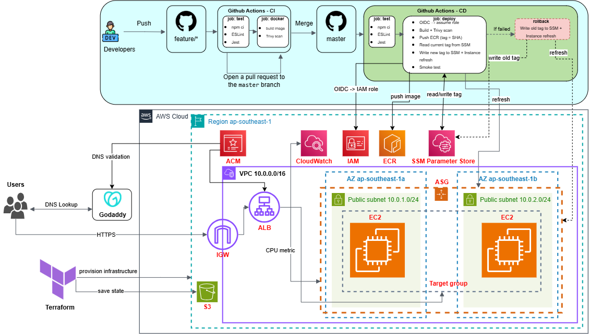

# Golden Owl DevOps Internship – CI/CD on AWS

A Node.js (Express) app containerized with Docker, built and deployed by GitHub Actions to AWS
(ALB + Auto Scaling Group), with all infrastructure defined in Terraform.

| Item | Value |
|------|-------|
| Repository | https://github.com/danh1508bku/goldenowl-devops-internship-challenge |
| Deployment | https://goapp.danhbku.xyz |
| Architecture diagram | [`docs/pics/diagram.png`](docs/pics/diagram.png) (source: [`docs/diagram.drawio`](docs/diagram.drawio)) |
| Final Docker image size | **119 MB**  |


## Architecture



**Request path:** user → DNS lookup at GoDaddy (`goapp` CNAME → ALB) → Internet Gateway → ALB (HTTP 80 redirects
to HTTPS 443, ACM certificate) → target group (HTTP 3000, health check `/`) → EC2 instances in two AZs.

**Deploy path:** push to `master` → GitHub Actions → OIDC role → image pushed to ECR (tag = commit SHA) → tag written
to SSM Parameter Store → ASG instance refresh → smoke test → automatic rollback on failure.

## CI/CD (GitHub Actions)

| Workflow | Trigger | What it does |
|----------|---------|--------------|
| `ci.yml` | push to `feature/**`, pull request to `master` | `npm ci`, ESLint, Jest, then Docker build (layer cache) and Trivy scan |
| `cd.yml` | push to `master` touching `src/**`, `scripts/**` or `cd.yml` | tests, build, Trivy, push to ECR, deploy via instance refresh, smoke test, rollback on failure |

Deployment steps in `cd.yml`:

1. Authenticate to AWS with **GitHub OIDC** (no long-lived access keys). The IAM role trusts only this repository's `master` branch.
2. Build the image, scan it with Trivy, push it to ECR tagged with the commit SHA.
3. Read the current tag from SSM Parameter Store `/goldenowl/image-tag` (kept for rollback), then write the new tag.
4. `scripts/refresh-asg.sh` starts an ASG instance refresh (rolling, at least 50% healthy, 90 s warm-up) and waits for it.
5. Smoke test against `https://goapp.danhbku.xyz`.
6. If the deploy or the smoke test fails, the workflow writes the previous tag back to SSM and refreshes the ASG again (automatic rollback).

New instances read the image tag from SSM at boot (user-data), log in to ECR, pull the image and run the container.

## Infrastructure (Terraform)

Requires Terraform >= 1.10 (S3 native state locking, `use_lockfile`).

```
terraform/
├── bootstrap/   # S3 bucket for remote state (versioning, encryption, public access blocked)
└── main/        # application infrastructure, state stored in the bucket above
```

| Resource | Notes |
|----------|-------|
| VPC `10.0.0.0/16` | two public subnets (`10.0.1.0/24` in `ap-southeast-1a`, `10.0.2.0/24` in `ap-southeast-1b`), Internet Gateway, public route table |
| ECR `goldenowl-app` | scan on push, lifecycle policy keeps the last 10 images |
| ALB `goldenowl-alb` | listener 80 redirects (301) to 443; listener 443 forwards to the target group (TLS 1.3/1.2 policy) |
| ACM certificate | DNS-validated for `goapp.danhbku.xyz` (CNAME records at GoDaddy) |
| Target group `goldenowl-tg` | HTTP 3000, health check `/` |
| Launch template + ASG `goldenowl-asg` | `t3.micro`, Amazon Linux 2023, IMDSv2 required, min 2 / max 4, ELB health checks, rolling instance refresh |
| Scaling policy | target tracking on average CPU, target 50% |
| Security groups | `alb-sg`: 80/443 from the internet. `app-sg`: 3000 only from `alb-sg` |
| IAM | EC2 role (ECR pull, read the image-tag parameter, SSM core); GitHub OIDC provider and deploy role |
| SSM Parameter `/goldenowl/image-tag` | image tag consumed by new instances |

Apply:

```bash
cd terraform/bootstrap && terraform init && terraform apply     # once
cd ../main && terraform init && terraform plan && terraform apply
```

## Auto scaling evidence

Load test: `hey -z 5m -c 500 -q 0 http://goldenowl-alb-161673432.ap-southeast-1.elb.amazonaws.com`

Timeline from the ASG activity history (2026-10-01, UTC+7):

| Time | Event |
|------|-------|
| 12:26 | CloudWatch alarm `TargetTracking-goldenowl-asg-AlarmHigh` triggered policy `goldenowl-cpu-target`: desired capacity 2 → 3, a new instance was launched in `ap-southeast-1b` |
| (afterwards) | 3 instances running, all status checks passed |
| 12:43 | After the load stopped, alarm `...-AlarmLow` triggered scale-in: desired capacity 3 → 2, one instance terminated |

Screenshots:

- [`docs/pics/asg-activity-scale-out.png`](docs/pics/asg-activity-scale-out.png): scaling activity
- [`docs/pics/asg-instances-3.png`](docs/pics/asg-instances-3.png): three running instances
- [`docs/pics/asg-activity-scale-in.png`](docs/pics/asg-activity-scale-in.png): scale-in activity
- [`docs/pics/asg-instances-after-scale-in.png`](docs/pics/asg-instances-after-scale-in.png): instances after scale-in

## Bonus items

- Trivy vulnerability scan in CI and CD (fails on fixed HIGH/CRITICAL findings)
- HTTPS on the load balancer (ACM certificate, HTTP → HTTPS redirect)
- Automatic rollback in the CD workflow
- Infrastructure fully defined with Terraform

## Security notes

- No long-lived AWS credentials: GitHub Actions assume a role through OIDC, restricted to this repository and the `master` branch.
- The deploy role has least-privilege permissions (push to one ECR repository, one SSM parameter, instance refresh on one ASG).
- App instances accept traffic on port 3000 only from the ALB security group; no SSH (shell access is possible through SSM).
- IMDSv2 is required on instances; the container runs as a non-root user.

## Known limitations

- Instances run in public subnets (no NAT Gateway) to keep the cost low; they are protected by security groups.
- If a bad image never becomes healthy, the instance refresh keeps waiting. The deploy script stops waiting after a fixed
  timeout (`scripts/refresh-asg.sh`) and then rolls back. During that time the old instances keep serving traffic.
